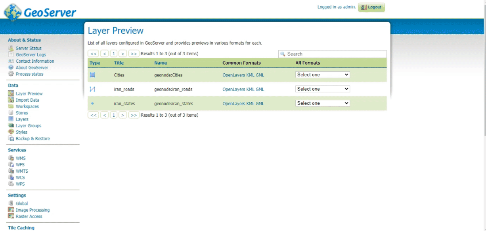

# WebGIS Project - Fall 2020 (KNTU)

This project was created for the WebGIS course at KNTU in Fall 2020. The application leverages OpenLayers to provide an interactive web map interface with advanced GIS functionalities, including layer identification, a catalog module for WMS layers, and tools for managing map layers. 

## Features

1. **Identify on WMS Layer**  
   Query and retrieve information from Web Map Service (WMS) layers.

2. **Identify on WFS Layer**  
   Query and retrieve data from Web Feature Service (WFS) layers.

3. **Layer Switcher**  
   Toggle visibility, zoom to extent, and remove layers, including thematic and base layers.

4. **Layer Catalog Module**  
   Access available WMS layers using the WMS `GetCapabilities` operation, allowing users to add layers directly from a WMS server.

5. **Scale Bar**  
   Display a scale bar for accurate distance measurements on the map.

6. **Zoom Controls**  
   Use zoom-in and zoom-out controls for better map navigation.

## Demonstration

| Feature                                | GIF                                           |
|----------------------------------------|-----------------------------------------------|
| Identify WMS/WFS Layers                |         |
| Catalog Module - Add WMS Layers        |       |
| Layer Switcher (Zoom, Toggle, Remove)  |      |

## Installation and Running the Project

To get started with this project, clone the repository and install the required dependencies.

```bash
git clone https://github.com/mahdin75/openlayers-custom-control-sample.git
cd openlayers-custom-control-sample
npm install
npm run start
```

To build the project for production:

```bash
npm run build
```

## Libraries Used

This project relies on the following libraries:

- **[jsonix](https://www.npmjs.com/package/jsonix)** (`^3.0.0`)  
- **[ogc-schemas](https://www.npmjs.com/package/ogc-schemas)** (`^2.6.1`)  
- **[ol](https://openlayers.org/)** (`^6.5.0`)  
- **[w3c-schemas](https://www.npmjs.com/package/w3c-schemas)** (`^1.4.0`)  

